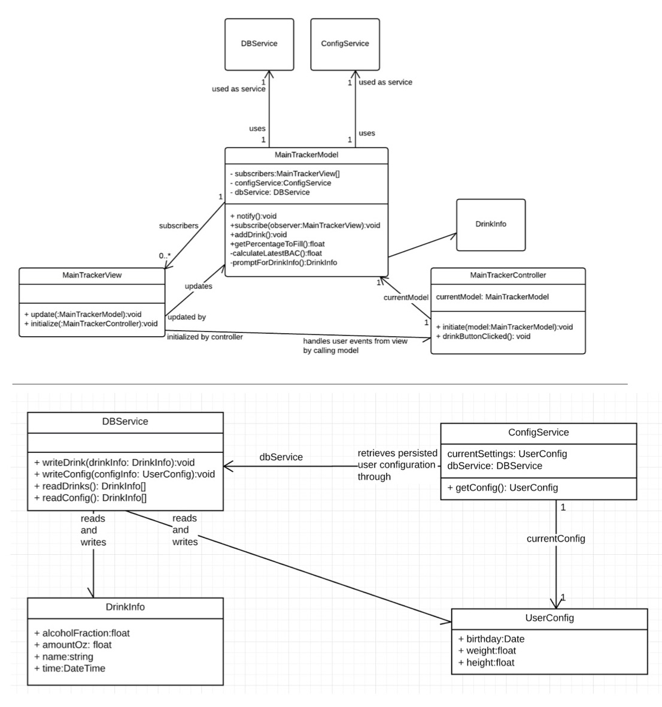
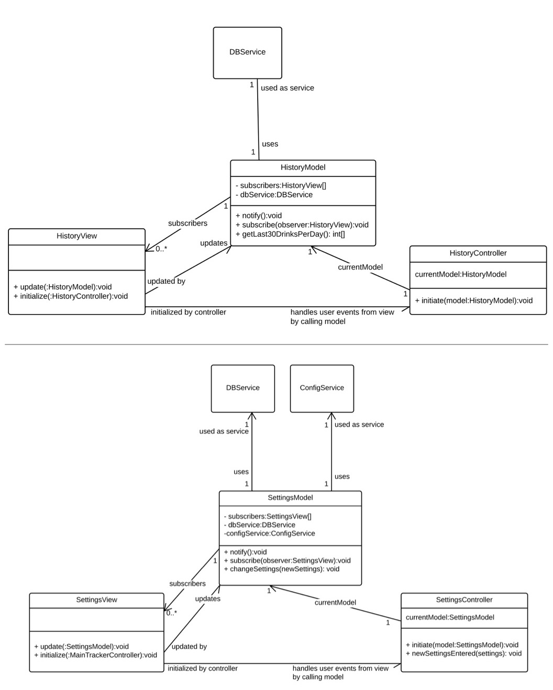
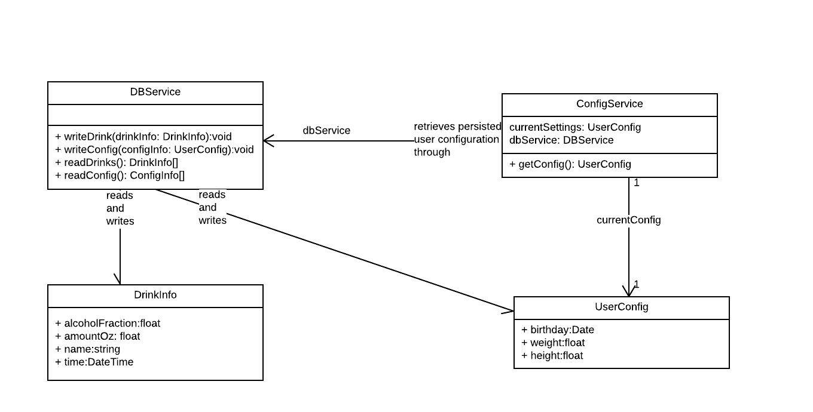
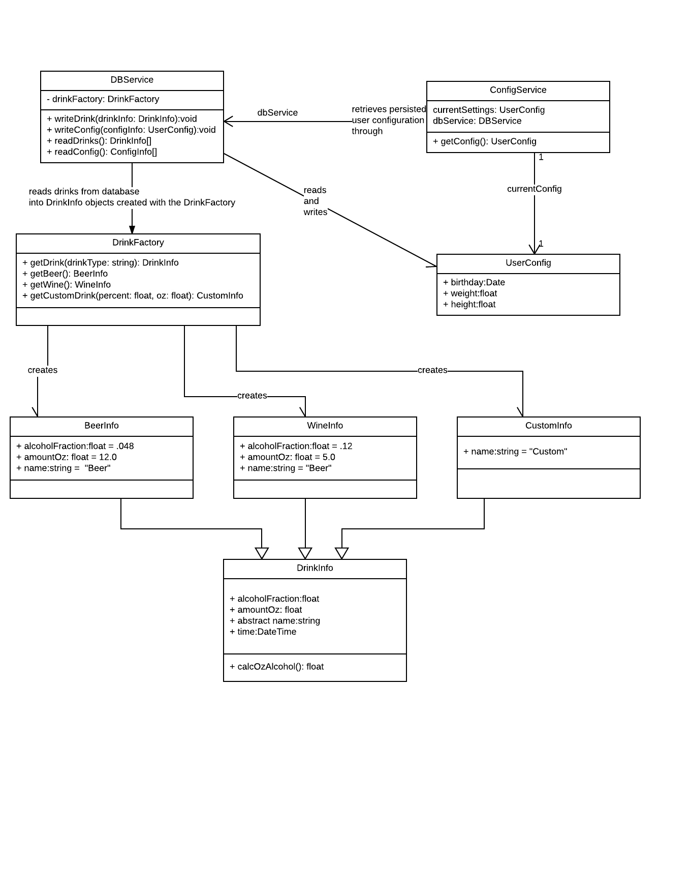

# BoozeTracker
## Project Part 3: Refactoring

Nathan Bellowe, Nathan McKenna, Yash Parekh

---

The purpose is to re-think through your design now that we have completed our study of Design Patterns and learning some Refactoring practices.

Submit a PDF file with your Project Part 2 class diagram and your new class diagram.

Describe any design patterns you’ve applied and show the portions of your new class diagram with those design patterns.

---

> Submit a PDF file with your Project Part 2 class diagram and your new class diagram.

 
 
 

---

>Describe any design patterns you’ve applied and show the portions of your new class diagram with those design patterns.
>Describe any other refactoring you have applied.

Analysis of our original system and it's class diagram noted the lack of a creational pattern used to create Drinks. This led to concerns with future maintenance of this piece of code. Applying the `Factory` pattern to build the `DrinkInfo`'s, instead of building them directly via their constructors, allows us to encapsulate the concept of creating `DrinkInfo`. In the future, we may want to utilize a `Flyweight` pattern, as lists of hundreds of `DrinkInfo` may gain performance by using shared states. The use of a creational pattern, along with subclassing each drink type to allow for shared state, allows for easy future application of the flyweight pattern if it gives performance gains in the future.

| Before |
|-|
|   |

With our new system, we have the `DatabaseService` offload the responsibility of initializing a drink to a drink factory. Now, the `DrinkFactory` can be modified to pool and cache objects, along with allow for flyweight patterns in lists of `DrinkInfo`. The Database Service has a new instance variable of a drinkFactory, and it utilizes it's `getDrink()` method to get a new `DrinkInfo` object.

|  After |
|-|
  |

The design continues to heavily incorporate a Model-View-Controller architecture. Each main screen has a model, view, and controller. Unfortunately, this does give parallel inheritance hierarchies, but we decided that this was intended by the design pattern. Combining them or altering the pattern would lose its intended effect - to encapsulate how a user views information, and how that information is operated on; any "code smell" from parallel inheritance hierarchies is outweighed by these benefits.

Our design also incorporates the observer pattern into the models. While this is used for the Model-View-Controller architecture, it is also useful for future modifications, as it gives a clear place to add additional functionality on model changes. The "model changed" event can act as a hook for many application events.
